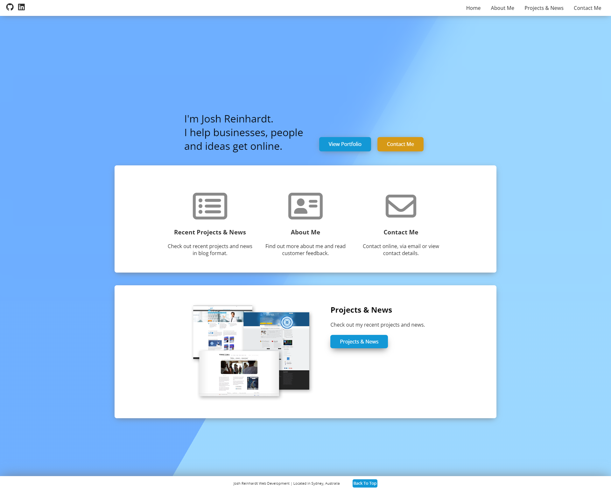
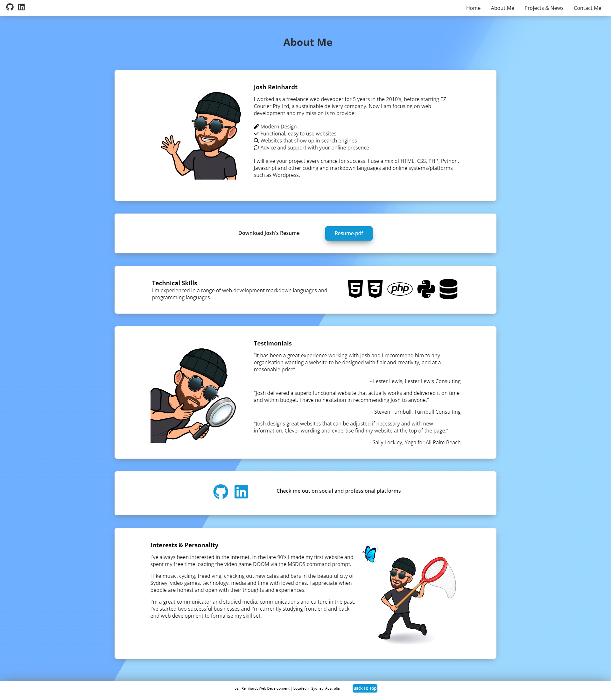
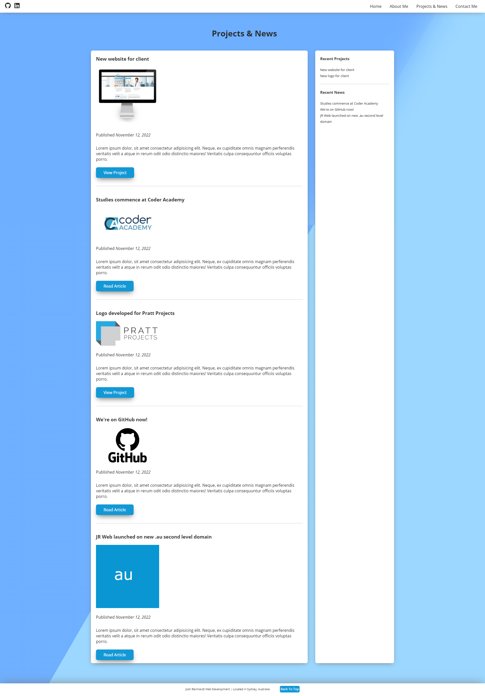
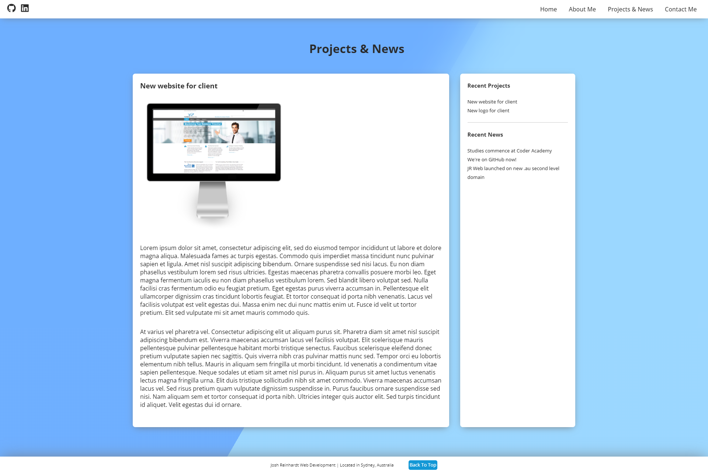
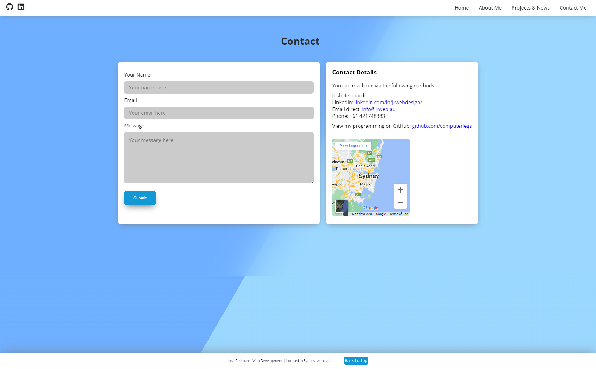

# Josh Reinhardt Portfolio Website
A portfolio website created as a student at Australian Institute of Technology Coder Academy.

Working version available at: http://jrweb.au  
GitHub repository available at: https://github.com/computerlegs/portfolio  
Presentation video available at:   

## Purpose  
The purpose of this portfolio website is to communicate and demonstrate my abilities to prospective employers in a clean, professional manner.

The website is intended to show my talent, abilities and coding experience.

The website ashowcases my projects and industry activity in blog format.

The website intends to demonstrate responsible and tasteful use of colours, design, and html/css componants that are creative, clean, easy to navigate or read read and consistent between pages.

The design chosen is intended to be familiar and easy to navigate.

## Functionality & Features

### Google Fonts

<p align="center">
  
</p>

I used Google Font 'Open Sans' by adding a link to the header of each HTML document:

```html
<link href="https://fonts.googleapis.com/css2?family=Open+Sans:ital,wght@0,300;0,400;0,500;0,600;0,700;0,800;1,300;1,400;1,500;1,600;1,700;1,800&display=swap" rel="stylesheet"> 
```

Then, I created a style rule with a 'font-family' property set to the value 'Open Sans' and applied it to the selector 'html'.

```css
html {
    font-family: "Open Sans", Arial;
}
```

### Responsive HTML & CSS Navigation

<p align="center">
  
</p>

Since this project uses HTML and CSS only, the navigation needed to rely on an HTML input with two states: the check box.

To make navigation simple and easy on mobile devices I implemented a hamburger style navigation menu that uses the pseudo class 'checked'. 

The toggle for the menu is a check box that is re-styled with CSS to look like the 'hamburger' style navigation icon. A checkbox type input was added using HTML with an ID applied to the input, and a class applied to the label.

 ```html
<input id="menu-toggle" type="checkbox"/>
<label class='menu-button-container' for="menu-toggle">
<div class='menu-button'></div>
</label>
 ```
 
Because the check box has two states, it can display content in two ways. This allows the menu to be displayed differently before and after a user presses it. The icon can also be styled between a 'hamburger' and a 'cross' using CSS and then animated between these two states with the property 'transform' and value 'rotate'. Below you can see the rotation transform in CSS as the input changes into the state 'checked'.

```css
#menu-toggle:checked + .menu-button-container .menu-button::before {
    margin-top: 0px;
    transform: rotate(405deg);
}
#menu-toggle:checked + .menu-button-container .menu-button::after {
    margin-top: 0px;
    transform: rotate(-405deg);
}
```

Media queries dictate when the 'hamburger' icon displays using a media query set at max width of 700px:

```css
.menu-button-container {
    display: none;
```

```css
@media (max-width: 700px) {
    .menu-button-container {
      display: flex;
    }
}
```

Media queries in combination with the 'checked' pseudo class dictate how list items are displayed depending on screen size and the state of the hamburger toggle. The tilde (~) symbol makes it so that only 'menu li' class list items following 'menu-toggle' ID items in the 'checked' state are styled. This is what makes the nav menu display as a drop down list when the checkbox is clicked.

```css
@media (max-width: 700px) {
    #menu-toggle ~ .menu li {
      height: 0;
      margin: 0;
      padding: 0;
      border: 0;
      transition: height 400ms cubic-bezier(0.23, 1, 0.32, 1);
    }
    #menu-toggle:checked ~ .menu li {
      border: 1px solid rgb(184, 184, 184);
      height: 2.5em;
      padding: 0.5em;
      transition: height 400ms cubic-bezier(0.23, 1, 0.32, 1);
    }
}
```

### Responsive header area with intro text and call to action buttons

<p align="center">
  
</p>  
<p align="center">
  
</p>

This header uses flex box to position intro text and two different coloured call to action buttons. Elements are aligned at the bottom of the container using the property 'align-items' and value 'flex-end'.

```css
header-container {
    display: flex;
    align-items: flex-end;
    justify-content: center;
}
```
The header area changes height and font-size based on viewport sizes. 

It is made with flexbox in two columns which allows the call to action buttons to move underneith the hero text on smaller width viewports.

This header is designed for every sort of viewport, including desktops, tablets, mobile phones and even landscape oriented mobile phone viewports. Below is the CSS for landscape oriented mobile sized viewports:

```css
@media (max-height: 500px) {
    .home-header {
        width: 100%;
        height: 100px;
        display: flex;
        flex-direction: row;
        justify-content: center;
        margin-top: 150px;
    }
    .home-header p {
        font-size: 1em;
    }
    .home-header-container {
        padding-bottom: 10px;
    }
}
```
### Font Awesome Icons

<p align="center">
  
</p>  

Font Awesome is the second most used 'font' on the internet. It facilitates scaleable, CSS based graphic sprites to be used as icons throughout a website. Icons behave as text and are styled through CSS rule sets in the same way.

Font Awesome is loaded in the html head as a .js script:

```html
<script src="https://kit.fontawesome.com/d5fab9e2ad.js" crossorigin="anonymous"></script>
```

Then placed onto the page using the 'i' element:

```html
<i class="fa-brands fa-github social-icons"></i>
```

I used the built-in animation effects which required in-line CSS on their custom variable:

```html
<i class="icons fa-regular fa-envelope fa-beat" style="--fa-animation-iteration-count: 1;"></i>
```

### Animated four layer background

<p align="center">
  
</p>

The website features a background effect that starts inside the header area and extends into the full page background. It is a single linear gradient full page section that achieves a sliding effect by cascading animation property changes in four 'div' placed in the header. The initial 'bg' class is combined with 'bg2' and 'bg3' classes which change the duration and direction. Each layer has opacity of 0.5 and the result is three distinct levels of depth. This is placed behind the div 'blurbg' which blurs the the sections into each other using the backdrop-filter property.

This section required the use of the z index property to ensure the linear gradient divs showed behind the blur and displayed behind all other areas of the site.

I used this dynamic background to give the website a sense of depth and movement without being too distracting. I chose blue because it gives a sense of being in the open, a sense of security, calmness and stability.

```css
.bg {
    animation: slide 6s ease-in-out infinite alternate;
    background-image: linear-gradient(-60deg, rgb(141, 210, 255) 50%, rgb(90, 164, 255) 50%);
    bottom: 0;
    left: -50%;
    opacity: .5;
    position: fixed;
    right: -50%;
    top: 0;
    z-index: -2;
}
.bg2 {
    animation-direction:alternate-reverse;
    animation-duration: 9s;
}
.bg3 {
    animation-duration:16s;
}
.blurbg {
    backdrop-filter: blur(55px);
    width: 100%;
    height: 100%;
    z-index: -1;
    opacity: 0.9;
    position: fixed;
    bottom: 0;
    top: 0;
    left: 0;
}
```

### Box shadow

<p align="center">
  
</p>  
<p align="center">
  
</p>  

To give areas of the website depth I applied various box shadows to the navigation, page content areas, and footer, and buttons. This was to further seperate the content from the background, and give a floating effect.

The box shadow changes slightly throughout the site, differeing in size and direction.

```css
.page-container {
    -webkit-box-shadow: 0 5px 20px -6px #777;
    -moz-box-shadow: 0 5px 20px -6px #777;
    box-shadow: 0 5px 20px -6px #777;
}

footer {
    -webkit-box-shadow: 0px -1px 40px -6px #777;
    -moz-box-shadow: 0px -1px 40px -6px #777;
    box-shadow: 0px -1px 40px -6px #777;
}
```

### Call to action button animation

Call to action buttons slide in from the left on the index page in order to draw the user's eye.

```css
/* animation for header buttons */
@keyframes slideInLeft {
    0% {
      transform: translateX(-100%);
    }
    100% {
      transform: translateX(0);
    }
}
.headerbutton {
    animation-duration: 0.3s;
    animation-timing-function: ease-in-out;
    animation-delay: 0s;
    animation-iteration-count: 1;
    animation-name: slideInLeft;
}
```

### Icon links to social platforms with _blank target

Icons in the nav bar, at the top left, link to GitHub and LinkedIn. They use Font Awesome icons and open the links with a "_blank" target, which opens them in a new page. That way users do not get directed away from my portfolio.

```html
<a target="_blank" href="https://www.linkedin.com/in/jrwebdesign/"><i class="fa-brands fa-linkedin social-icons"></i></a>
```

### Blog section with sidebar that moves underneith blog posts depending on viewport width

<p align="center">
  
</p>  
<p align="center">
  
</p>  

The blog page contains some interesting use of Flexbox. Using the flex value, the sidebar moves _underneith_ the blog posts depending on viewport. At 600px, the flex value changes from sharing space at 3/4 and 1/4 to both taking 1/1 available width.

This means that for tablet and desktop views, the sidebar is on the right. On mobile views, it displays after the blog list or the article.

```css
@media (min-width: 600px) {
    .page-blog-sidebar {
        flex: 1;
    }
    .page-blog-main {
        flex: 3;
    }
    .page-blog-flex-grid {
        flex-direction: row;
    }
}
@media (max-width: 600px) {
    .page-blog-sidebar {
        flex: 1;
        width: 92%;
        margin: 0 auto;
    }
    .page-blog-main {
        flex: 1;
    }
}
```
### Uniform site content area widths

I achieved this with a main-box class, page-wrapper class and page-container class. The page-wrapper has a max width of 1200px, and page-container has a width of 100%. The main box simply has padding on either side for mobiles. This made the design responsive but capped at 1200px. It allowed me to be flexible with my elements, but still consistent in the width that they are displayed.

The padding on left and right sides really made the website pop on mobile phones, as rather than just being flat white space the animated background could be seen on either side and between each section. In my opinion, this gave the mobile view of the website a much more dynamic feel and felt more like a 'web app' than a 'website'.

```css
.main-box {
    padding: 0px 15px 0px 15px;
    min-height: 100%;
}
.page-wrapper {
    display:flex;
    justify-content: center;
    flex-direction: row;
    max-width: 1200px;
    margin: 0 auto;
}
.page-container {
    padding: 40px;
    background-color: #fff;
    border-radius: 7px;
    display: flex;
    flex-direction: row;
    text-align: left;
    flex-wrap: wrap;
    justify-content: center;
    margin: 20px 0px 20px 0px;
    width: 100%;
    -webkit-box-shadow: 0 5px 20px -6px #777;
    -moz-box-shadow: 0 5px 20px -6px #777;
    box-shadow: 0 5px 20px -6px #777;
}
```

### Deployed on new .au second level domain

<p align="center">
  
</p>  

Very recently at time of writing (November 11, 2022) the new second level domain ".au" became available to register. I took advantage of this and registered a 5 character domain, jrweb.au.

I used TPP Wholesale (https://www.tppwholesale.com.au/) to register the domain name.

I used Panthur (https://www.panthur.com.au/) for website hosting.

To link the domain to the hosting I changed the nameservers in the TPP console to Panthur nameservers.

I chose Panthur hosting because they offer a reseller package, which means that I can offer hosting services myself to future clients. However, they do not offer .au domain names - this is why I needed to use TPP for the domain and change nameservers.

### Custom favicon

<p align="center">
  
</p>  

The website features a basic favicon which is displayed in tabs, the address bar or bookmarks.

It was made using [favicon.io](https://favicon.io).

### Anchor links for 'back to top' in footer

I used anchor links to create a link from one part of the document to another. This links the bottom of the document to the top for fast navigation.

```html
<a href="#top" class="back-to-top-link">Back To Top</a>
```

### Contact form with custom styling

The contact form on the contact page is custom styled to match the rest of the website, and uses PHP to action it. I plan to improve the contact form to include validation at a later date.

```php
<?php $name = $_POST['Name'];
$email = $_POST['Email'];
$message = $_POST['Message'];
$formcontent="From: $name \n Message: $message";
$recipient = "imjoshua@gmail.com";
$subject = "jrweb.au contact";
$mailheader = "From: $email \r\n";
mail($recipient, $subject, $formcontent, $mailheader) or die("Error!");
echo "Thank You!";
?>
```

## Sitemap

The website consists of nine html pages and a single php page.

<p align="center">
  
</p>
 

## Screenshots

### Mobile

<p align="center">
  
</p>

<p align="center">
  
</p>

<p align="center">
  
</p>

<p align="center">
  
</p>

<p align="center">
  
</p>

### Tablet

<p align="center">
  
</p>

<p align="center">
  
</p>

<p align="center">
  
</p>

<p align="center">
  
</p>

<p align="center">
  
</p>

### Desktop

<p align="center">
  
</p>

<p align="center">
  
</p>

<p align="center">
  
</p>

<p align="center">
  
</p>

<p align="center">
  
</p>

## Target Audience

The target audience for this website are prospective employers and freelance clients.

## Tech stack

HTML language  
CSS language  
PHP language  
Visual Studio Code software  
Figma wireframes online platform  
FileZilla FTP software  
Mozilla Firefox browser  
Firebug Mozilla Inspector extension
Google Chrome browser  
GoFullPage Chrome Screenshot extension
Font Awesome Icons  
Google Maps API  
Gloomaps sitemap online platform  
Favicon.io online favicon generator 
BitMoji emoji avatar creator 
CPanel  
Windows 10  